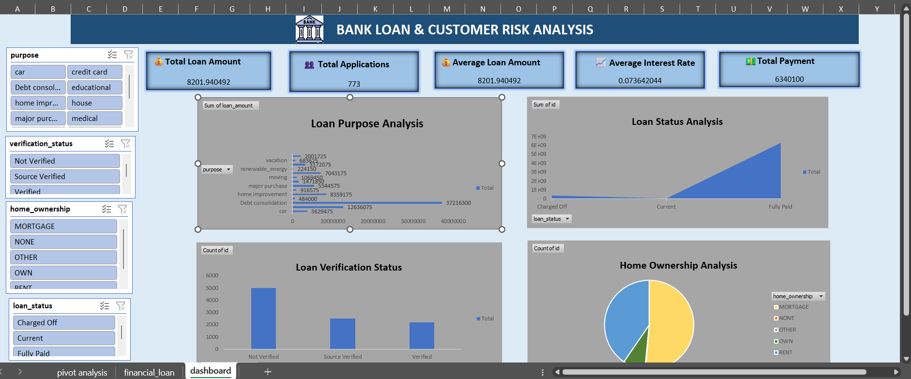

# 🏦 Bank Loan & Customer Risk Analysis Dashboard

## 📊 Project Overview

This project analyzes bank loan data and customer risk using Microsoft Excel.

The interactive dashboard provides insights into loan performance, customer characteristics, and risk indicators.

## 🛠️ Tools Used

- Microsoft Excel
- PivotTables
- PivotCharts
- Slicers
- KPI Cards
- Data Cleaning
- Data Analysis
- Data Visualization

## 📌 Dashboard Features

- Total Loan Amount
- Total Loans
- Average Loan Amount
- Average Interest Rate
- Average DTI
- Loan Status Distribution
- Loan Amount by Grade
- Monthly Loan Amount Trend
- Loan Purpose Analysis
- Loan Verification Status
- Home Ownership Analysis
- Interactive Slicers

## 🎯 Project Objective

To transform raw bank loan data into an interactive Excel dashboard that helps analyze loan portfolio performance and customer risk.

## 📷 Dashboard Preview

## 📁 Project Files

- `financial_loan.xlsx` — Excel analysis and dashboard
- `dashboard.png` — Dashboard preview
- `README.md` — Project documentation
